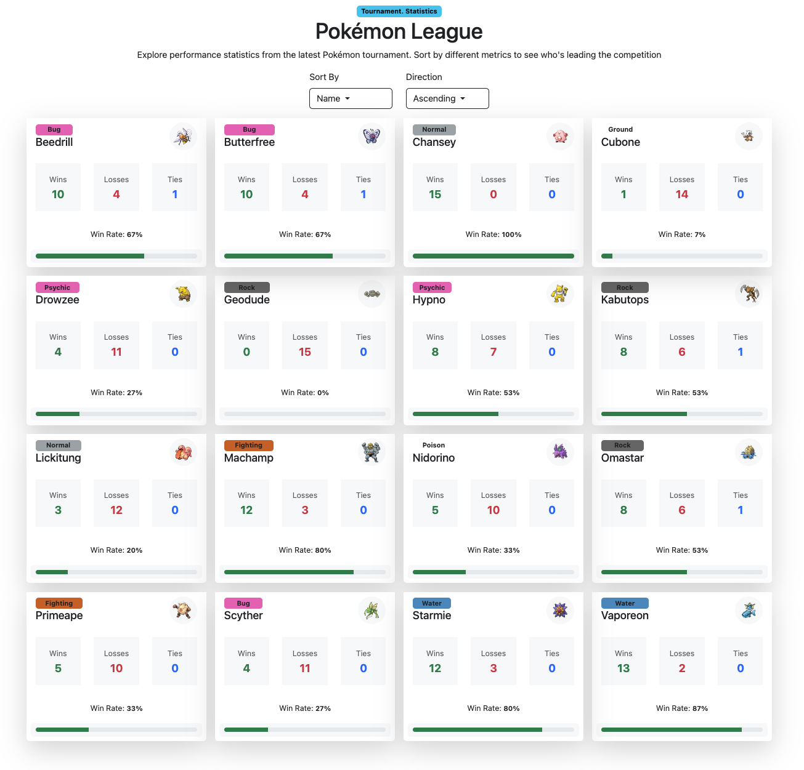

# PokemonTournament

This project was generated using [Angular CLI](https://github.com/angular/angular-cli) version 20.3.8. 
Implemented during 1 working day.

## Development server

To start a local development server, run:

```bash
npm install
npm start
```

Once the server is running, open your browser and navigate to `http://localhost:4200/`. The application will automatically reload whenever you modify any of the source files.

Implemented responsive design for pokemon battle


